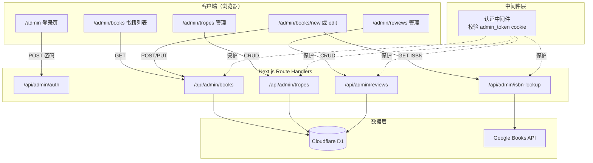

# 设计文档

## 概述

为 SpicyBooks 网站构建一个后台管理系统，部署在 `/admin` 路径下。系统采用 Next.js App Router 架构，后台页面使用客户端渲染（`"use client"`），通过 Next.js Route Handlers 提供 API 接口，数据存储在 Cloudflare D1 (SQLite) 中。

认证采用简单的密码比对方案：用户提交密码后与环境变量 `ADMIN_PASSWORD` 比较，验证通过后设置签名的 HTTP-only cookie。所有后台 API 路由通过中间件统一校验 cookie 有效性。

书籍管理表单采用分步设计（5 步），支持通过 Google Books API 按 ISBN 自动填充基础信息。Trope 和评论管理提供独立的列表页面和内联编辑功能。

## 架构



### 设计决策

1. **客户端渲染后台页面**：后台不需要 SEO，使用 `"use client"` 组件 + `fetch` 调用 API，简化开发。
2. **Next.js Middleware 做认证**：利用 `middleware.ts` 拦截 `/admin`（非登录页）和 `/api/admin` 路由，统一校验 cookie，避免每个 API 重复认证逻辑。
3. **签名 cookie 认证**：使用 HMAC-SHA256 对 token 签名，密钥为 `ADMIN_PASSWORD` 本身。不引入 JWT 库，保持轻量。cookie 设置 `HttpOnly`、`Secure`、`SameSite=Strict`、`Path=/admin` 和 `/api/admin`。
4. **API 路由放在 `/api/admin/` 下**：与前端公开 API 隔离，便于中间件统一保护。
5. **Google Books API 调用放在服务端**：通过 `/api/admin/isbn-lookup` Route Handler 调用，避免在客户端暴露 API 调用细节。

## 组件与接口

### 页面组件

| 路径 | 组件 | 渲染方式 | 说明 |
|------|------|----------|------|
| `/admin` | `AdminLoginPage` | Client | 登录表单 |
| `/admin/books` | `AdminBookList` | Client | 书籍列表，搜索+分页 |
| `/admin/books/new` | `AdminBookForm` | Client | 添加新书（分步表单） |
| `/admin/books/[slug]/edit` | `AdminBookForm` | Client | 编辑书籍（复用表单，预填数据） |
| `/admin/tropes` | `AdminTropes` | Client | Trope 列表+内联增删改 |
| `/admin/reviews` | `AdminReviews` | Client | 评论列表+添加/删除 |

### API 路由

| 路径 | 方法 | 说明 |
|------|------|------|
| `/api/admin/auth` | POST | 登录验证，设置 cookie |
| `/api/admin/auth` | DELETE | 登出，清除 cookie |
| `/api/admin/books` | GET | 获取书籍列表（支持 `?search=&page=&limit=` 查询参数） |
| `/api/admin/books` | POST | 创建新书 |
| `/api/admin/books/[slug]` | GET | 获取单本书详情（含 tropes 和 reviews） |
| `/api/admin/books/[slug]` | PUT | 更新书籍 |
| `/api/admin/books/[slug]` | DELETE | 删除书籍 |
| `/api/admin/tropes` | GET | 获取所有 tropes |
| `/api/admin/tropes` | POST | 创建 trope |
| `/api/admin/tropes/[slug]` | PUT | 更新 trope |
| `/api/admin/tropes/[slug]` | DELETE | 删除 trope |
| `/api/admin/reviews` | GET | 获取所有评论（支持 `?book_slug=` 过滤） |
| `/api/admin/reviews` | POST | 创建评论 |
| `/api/admin/reviews/[id]` | DELETE | 删除评论 |
| `/api/admin/isbn-lookup` | GET | 通过 ISBN 查询 Google Books API |

### 共享工具函数

| 函数 | 位置 | 说明 |
|------|------|------|
| `slugify(title)` | `src/lib/utils.ts` | 从书名生成 slug |
| `buildAmazonUrl(asin)` | `src/lib/utils.ts` | 从 ASIN 构建 Amazon Associates URL |
| `verifyAdminToken(cookie)` | `src/lib/admin-auth.ts` | 验证签名 cookie |
| `createAdminToken()` | `src/lib/admin-auth.ts` | 创建签名 token |

### 客户端组件

| 组件 | 说明 |
|------|------|
| `BookFormSteps` | 分步表单容器，管理步骤导航和表单状态 |
| `StepBasicInfo` | 步骤1：基础信息 + ISBN 自动填充 |
| `StepSpiceInfo` | 步骤2：Spice 信息，含滑块控件 |
| `StepTagsCategories` | 步骤3：标签和分类，含 TagInput 和 trope checkbox |
| `StepEditorial` | 步骤4：编辑内容 |
| `StepRelatedData` | 步骤5：关联数据 |
| `TagInput` | 可复用的标签输入组件 |
| `ListInput` | 可动态添加/删除条目的列表组件 |

## 数据模型

### 书籍表单数据类型

```typescript
// src/lib/admin-types.ts

interface BookFormData {
  // Step 1: 基础信息
  slug: string;
  title: string;
  author: string;
  description: string;
  page_count: number | null;
  publish_year: number | null;
  isbn: string;
  cover_url: string;
  asin: string;  // 仅存 ASIN，提交时转换为 amazon_url

  // Step 2: Spice 信息
  spice_level: number;
  spice_description: string;
  spicy_scene_count: number | null;
  steam_level: string;
  pov_style: string;

  // Step 3: 标签和分类
  tropes: string[];          // trope slug 数组
  subgenres: string[];
  content_warnings: string[];
  moods: string[];

  // Step 4: 编辑内容
  editorial_review: string;
  perfect_for: string[];
  skip_if: string[];

  // Step 5: 关联数据
  similar_books: string[];   // book slug 数组
  series_name: string;
  series_number: number | null;
  series_total_books: number | null;
  narrator: string;
}
```

### API 请求/响应类型

```typescript
// 书籍列表响应
interface BookListResponse {
  books: Array<{
    slug: string;
    title: string;
    author: string;
    cover_url: string;
    spice_level: number;
    created_at: string;
  }>;
  total: number;
  page: number;
  limit: number;
}

// ISBN 查询响应
interface IsbnLookupResponse {
  title: string;
  author: string;
  description: string;
  page_count: number;
  publish_year: number;
  isbn: string;
  cover_url: string;
}

// Trope 表单数据
interface TropeFormData {
  slug: string;
  name: string;
  description: string;
  emoji: string;
}

// 评论表单数据
interface ReviewFormData {
  book_slug: string;
  username: string;
  spice_rating: number;
  text: string;
  date: string;
  source: string;
}
```

### 认证 Token 结构

```typescript
// cookie 值格式: `${timestamp}.${hmac_signature}`
// timestamp: token 创建时间（Unix 毫秒）
// hmac_signature: HMAC-SHA256(timestamp, ADMIN_PASSWORD) 的 hex 编码
// cookie 有效期: 7 天
```

### 数据库操作

书籍创建/更新涉及两个表的事务操作：
1. `INSERT/UPDATE` books 表
2. `DELETE` 旧的 book_tropes 关联 + `INSERT` 新的关联

D1 不支持真正的事务，但支持 `db.batch()` 批量执行，保证原子性。

</text>
</invoke>

## 正确性属性

*正确性属性是一种在系统所有有效执行中都应成立的特征或行为——本质上是关于系统应该做什么的形式化陈述。属性作为人类可读规范和机器可验证正确性保证之间的桥梁。*

### Property 1: Slug 生成正确性

*For any* 字符串作为书名输入，`slugify` 函数生成的 slug 应满足：(a) 全部为小写字母，(b) 仅包含 `[a-z0-9-]` 字符，(c) 不以连字符开头或结尾，(d) 不包含撇号或单引号字符。

**Validates: Requirements 5.1, 5.2, 5.3, 5.4**

### Property 2: ASIN URL 构建正确性

*For any* 非空 ASIN 字符串，`buildAmazonUrl` 函数生成的 URL 应满足：(a) 以 `https://www.amazon.com/dp/` 开头，(b) 包含输入的 ASIN，(c) 包含 `tag=chessanalys05-20` 查询参数。当 ASIN 为空字符串时，返回空字符串。

**Validates: Requirements 8.1, 8.2, 8.3**

### Property 3: 书籍 CRUD 往返一致性

*For any* 有效的书籍表单数据，通过 API 创建书籍后再读取，返回的数据应与提交的数据等价（字段值一致）。同样，更新书籍后再读取，返回的数据应反映更新后的值。

**Validates: Requirements 4.9, 4.10**

### Property 4: 书籍删除有效性

*For any* 已存在的书籍，通过 API 删除后，再次查询该 slug 应返回 404 或空结果。

**Validates: Requirements 4.11**

### Property 5: Trope CRUD 往返一致性

*For any* 有效的 trope 数据，通过 API 创建 trope 后再读取，返回的数据应与提交的数据等价。更新 trope 后再读取，返回的数据应反映更新后的值。

**Validates: Requirements 6.2, 6.3**

### Property 6: Trope 删除有效性

*For any* 已存在的 trope，通过 API 删除后，再次查询该 slug 应返回 404 或空结果。

**Validates: Requirements 6.4**

### Property 7: 评论创建往返一致性

*For any* 有效的评论数据和已存在的书籍，通过 API 创建评论后，查询该书籍的评论列表应包含刚创建的评论。

**Validates: Requirements 7.2**

### Property 8: 评论删除有效性

*For any* 已存在的评论，通过 API 删除后，查询评论列表应不再包含该评论。

**Validates: Requirements 7.3**

### Property 9: API 认证保护

*For any* 受保护的 Admin_API 端点，未携带有效认证 cookie 的请求应返回 HTTP 401 状态码；携带有效认证 cookie 的请求应不返回 401。

**Validates: Requirements 9.1, 9.2**

### Property 10: 分页正确性

*For any* 书籍集合和页码参数，API 返回的书籍数量应不超过每页限制（20），且 total 字段应等于数据库中的书籍总数。

**Validates: Requirements 2.1**

### Property 11: 搜索过滤正确性

*For any* 搜索关键词和书籍集合，API 返回的每本书的书名或作者名应包含该搜索关键词（不区分大小写）。

**Validates: Requirements 2.2**

## 错误处理

| 场景 | 处理方式 |
|------|----------|
| 密码错误 | 返回 401，前端显示"密码错误"提示 |
| Cookie 过期/无效 | 中间件重定向到登录页 |
| Google Books API 失败 | 返回错误信息，前端提示用户手动填写 |
| Google Books API 无结果 | 返回空结果，前端提示未找到并允许手动填写 |
| 创建书籍 slug 冲突 | 返回 409 Conflict，前端提示修改 slug |
| 删除被引用的 trope | 依赖数据库 CASCADE 删除 book_tropes 关联 |
| 表单验证失败 | 前端在提交前校验必填字段，API 端也做校验返回 400 |
| D1 数据库错误 | 返回 500，前端显示通用错误提示 |

## 测试策略

### 属性测试（Property-Based Testing）

使用 `fast-check` 库进行属性测试，每个属性测试至少运行 100 次迭代。

重点测试纯函数和数据转换逻辑：
- `slugify` 函数（Property 1）
- `buildAmazonUrl` 函数（Property 2）

这些纯函数适合属性测试，因为它们没有副作用，可以用随机输入验证不变量。

### 单元测试

使用 `vitest` 进行单元测试，覆盖：
- 认证 token 的创建和验证（createAdminToken / verifyAdminToken）
- API Route Handlers 的请求处理逻辑（使用 mock D1）
- 表单数据到数据库记录的转换
- 边界情况：空 ASIN、特殊字符书名、超长输入等

### 集成测试

- 书籍 CRUD 完整流程（创建 → 读取 → 更新 → 删除）
- Trope CRUD 完整流程
- 评论 CRUD 完整流程
- 认证保护验证（无 cookie → 401，有 cookie → 200）
- 搜索和分页功能

### 测试标注格式

每个属性测试必须用注释标注对应的设计属性：

```typescript
// Feature: admin-book-management, Property 1: Slug 生成正确性
test.prop("slugify produces valid slugs for any input", [fc.string()], (title) => {
  const slug = slugify(title);
  // assertions...
});
```
